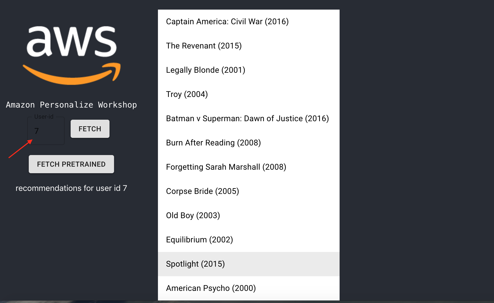

Amazon Personalize Workshop
======


# 1. Setup S3
------

## 1.1 Create bucket S3 
Please note we are using us-west-2 region (Oregon) for this workshop.

For this workshop we will need to setup a bucket we will use for
personalize. Go to S3 console
<https://s3.console.aws.amazon.com/s3/home?region=us-west-2>, and create
a new bucket to be used for this workshop.

Keep the bucket name handy as we will need it in a few places.

## 1.2 Setup bucket policy
Go to S3 console, select the bucket you created earlier for this
workshop and select properties-\>permissions. Then select the bucket
policy button and copy the policy below and click **save**.

Don't forget to change the resource details to the bucket you created
for this workshop.

```
{
	"Version": "2012-10-17",
	"Id": "PersonalizeS3BucketAccessPolicy",
	"Statement": [{
		"Sid": "PersonalizeS3BucketAccessPolicy",
		"Effect": "Allow",
		"Principal": {
			"Service": "personalize.amazonaws.com"
		},
		"Action": [
			"s3:GetObject",
			"s3:ListBucket"
		],
		"Resource": [
			"arn:aws:s3:::your-s3-bucket",
			"arn:aws:s3:::your-s3-bucket/*"
		]
	}]
}

```

# 2. Setup your development environment
We will be using Cloud9 for this workshop. Go to the Cloud9 console and
create a new environment:

<https://us-west-2.console.aws.amazon.com/cloud9/home?region=us-west-2>.

Name the environment **personalize-workshop**


Select following settings and press next

-   **Create a new instance for environment (EC2)**

-   **t2.small** instance type

-   **Amazon Linux**

-   Cost-saving setting leave **After 30 minutes (default)**


Press **Create environment** and wait for your new environment to be available to use.   


# 3. Get sample data files and demo app
On the top of the screen click the plus sign to open a new terminal


Using the terminal get the project files

```sh
git clone https://github.com/perima/personalize-workshop.git
```  

Change folder to the workshop folder

```sh
cd personalize-workshop
```

Copy the sample data files to the s3 bucket (you **must** change the details
below to use the bucket you created earlier)

```sh
aws s3 cp ./sample-data/ s3://**your-s3-bucket**/imports --recursive
```

update the AWS CLI

```sh
pip install --user --upgrade awscli
```

install and use Node.js v8.10 (to match AWS Lambda)

```sh
nvm install v8.11.0 nvm alias default v8.11.0
```

install the AWS Amplify CLI

```sh
npm install -g @aws-amplify/cli
```

configure default region for the CLI

```sh
cat <<END > ~/.aws/config
[default]
region=us-west-2
END
```

# 4. Create the dataset 
In a separate browser tab, go to the Amazon Personalize homepage
(<https://us-west-2.console.aws.amazon.com/personalize/home?region=us-west-2#start>)
and click the get started button.


## 4.1 Create dataset group
Set the dataset group name to ***personalize-workshop*** and click
**Next**.


Set the dataset name to ***ratings***


Select **Create new schema**


Set the schema name to **ratings-schema**

Set the schema definition to the following

```sh
{
	"type": "record",
	"name": "Interactions",
	"namespace": "com.amazonaws.personalize.schema",
	"fields": [
		{
			"name": "USER_ID",
			"type": "string"
		},
		{
			"name": "ITEM_ID",
			"type": "string"
		},
		{
			"name": "rating",
			"type": "double"
		},
		{
			"name": "timestamp",
			"type": "long"
		}
	],
	"version": "1.0"
}
```

Click **next**.

## 4.2 Create user-item interaction dataset & import
Set the dataset import job name to
**personalize-workshop-interactions***.*


Select **create a new role** from the IAM service role dropdown


Select **Any S3 bucket** from the options and press **Create role**.


Set the S3 location to **s3://your-s3-bucket/imports/ratings.csv**
(don't forget to replace your-s3-bucket to the name of the bucket you
setup in the setup part of this workshop).


Press **Finish**.

The personalize dashboard should reflect that your import is running for
user-item interactions as per screenshot below.


# 5. Setup Item dataset

## 5.1 Configure Item schema
  
Click the **Import** button next to Item data at the bottom of the dashboard.   


Set the dataset name to **movies-dataset**.


Select **Create new schema**


Set the schema name **movies-schema**.


Copy and paste the following schema to the schema definition input

```sh
{
	"type": "record",
	"name": "Items",
	"namespace": "com.amazonaws.personalize.schema",
	"fields": [
		{
			"name": "ITEM_ID",
			"type": "string"
		},
		{
			"name": "title",
			"type": "string"
		},
		{
			"name": "GENRE",
			"type": "string",
			"categorical": true
		}
	],
	"version": "1.0"
}
```


Press **Next**.

## 5.2 Configure movies dataset import job details
Set **personalize-workshop-movies-import** as the name for the import
job.

Leave the IAM role to the one automatically selected (it should be the
new role created in the earlier part of this workshop).

Input your S3 bucket details which should be something like
s3://**your-s3-bucket**/imports/movies.csv (don't forget to replace
your-s3-bucket with your actual bucket name).


Press **Start import**.

You should be redirected to the dashboard and see that your item import is now running.


# 6. Tracker solution
Whilst we wait for our imports to complete, we will setup our solution to ingest events from our single page application. 

For this you need to select the SDK installation from the dashboard.


Set **personalize-workshop-tracker** as the tracker name and press
**Next**


In the next page you will see "Tracking ID" generated for you. We will do the rest of the SDK installation later so Click the **Finish** button.


 

Your dashboard should now reflect your event tracker is active.   
  


Please note this step will take a few minutes to complete (\~15
minutes). Wait for **both** **imports** to show as active
**before** proceeding to next step.

# 7. Create Solution
Once your user-item interaction and Item data have finished creating
(importing), It's time to setup our first solution. From your dashboard
select create solution. Please note that your dataset imports must have
finished before this step.

Use **personalize-workshop-solution** as the solution name.

Select **Automatic (AutoML)** from the recipe selection options.


Press **Next**.

Press **Finish** in the Create Solution version screen (please note you
will get an error if your dataset imports haven't finished).


You should now be redirected to the dashboard, which should reflect that your solution creation is now in progress.   


Please note this step can take 30 to 45 minutes to complete. Proceed to next step whilst this step is processing in the background.

# 8 Test our campaign using the single page demo app 

Go back to your Cloud9 environment.

## 8.1 Configure amplify project

Please make sure you deploy in the same region as per the personalize
solution, which is us-west-2 (Oregon). You can check the region of your Cloud9 environment by clicking on the "AWS Resources" tab on the right hand panel.


Go to the root of your working directory (something like
~/environment/personalize-workshop) and execute

```sh
amplify init
```

Amplify CLI will ask a few questions to initialize the project. Please
use following answers

Do you want to use an existing environment? (Y/n): No

Enter a name for the environment: pworkshop

Choose your default editor: scroll down to None

Do you want to use an AWS profile? (Y/n): Yes (then select default)

Now install required node modules by running

```sh
npm install --save
```

## 8.2 Run the app in preview
Using the terminal execute

```sh
npm start
```

Once the build has completed, select Preview-\>Preview Running
Application from the cloud9 top menu.


You should now see a preview window with your app


At the top right of your preview click the icon  to preview the app in a separate browser tab.


Once your new preview tab is open you can close the preview tab inside
the cloud9 to have more space for your IDE.


## 8.3 Test using the pre-deployed personalize campaign
Whilst we wait for the training to complete we will test first using a
campaign we deployed earlier using the same dataset.

Press the Fetch pretrained button on the left. Feel free to change the
user id to see different recommendations.


Our single page application is calling a public rest endpoint from a
previously deployed version of the workshop which was also trained with
the same dataset. You should see recommendations listed every time you
press the fetch pretrained.


Stop the locally running app by pressing CTL+C.

# 9. Create Campaign

Once your solution creation is active you are ready to create a campaign so that your application can get recommendations.

In the personalize dashboard click start next to campaign creation. 


In the create new campaign screen use **personalize-workshop-campaign**
as the campaign name.

Select the solution name you created in the earlier part of this
workshop

Leave the minimum provisioned transactions per second to 1.

Click **create campaign**


You should now see your new campaign.


You can check the campaign status by selecting the details tab.


Copy the Campaign ARN for use in the steps later. You can start using it once the status shows as active. This step can
take five to ten minutes.

Once the campaign shows as active, go back to the campaign homepage to
test it.


Input a user id (example 5) and click the Get Recommendations button.

You should see a list of recommended movie IDs


## 9.1 Configure your campaign details in your single page application
Once your campaign is active, go back to your Cloud9 IDE and to edit
file

**/amplify/backend/function/personalizeworskhopeaea06ed/src/app.js**


Change the value of campaignArn to the arn of your campaign in
personalize.


Save the file.

We now need to deploy our amplify backend. In the Cloud9 terminal
execute

```sh
  amplify push
```

and answer yes when asked if you are sure if you want to continue. This
will deploy an API gateway endpoint and the lambda function you edited.
Your lambda function will be connecting to the Personalize campaign.

## 9.2 Get recommendations


Once your Amplify backend has been deployed, you can get recommendations
from your own campaign by entering a user ID and pressing the FETCH
button. Results will appear on the right.

Start your app again.

```sh
npm start
```

Once the build has completed, select Preview-\>Preview Running
Application from the cloud9 top menu.



# 10. Clean-up
Time to clean up by removing the resources of our workshop.

In your cloud9 environment using the terminal run **amplify env remove
workshop** to delete your provisioned cloud environment resources.

In the Personalize console delete your campaign; once complete delete
your solution and then the datasets.

Delete your S3 bucket.

Stop and delete your cloud9 environment

# Appendix 1
Create a new policy with the statement below and attach to your role.

This step is **only required** if you encounter a problem creating a new
role in the personalize console.

S3 policy for personalize in case automatic role creation fails

```js
{
    "Version": "2012-10-17",
    "Statement": [
        {
            "Action": [
                "s3:ListBucket"
            ],
            "Effect": "Allow",
            "Resource": [
                "arn:aws:s3:::*"
            ]
        },
        {
            "Action": [
                "s3:GetObject",
                "s3:PutObject"
            ],
            "Effect": "Allow",
            "Resource": [
                "arn:aws:s3:::*"
            ]
        }
    ]
}
```

Attach [AmazonPersonalizeFullAccess](https://console.aws.amazon.com/iam/home?region=us-west-2#/policies/arn%3Aaws%3Aiam%3A%3Aaws%3Apolicy%2Fservice-role%2FAmazonPersonalizeFullAccess) policy.


